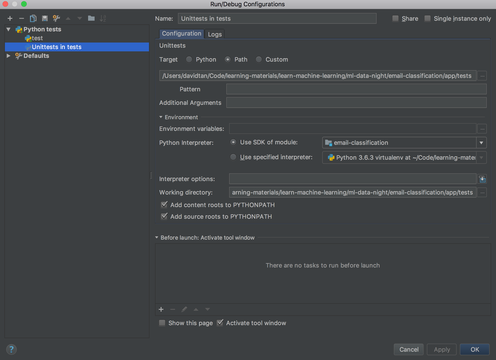

# Email classification 

## Data
 
Source: http://bailando.sims.berkeley.edu/enron_email.html

## Getting started

1. Clone the repo and `cd` into the directory: `git clone https://github.com/your-username/email-classification && cd email-classification`

3. Run `bin/setup.sh`. This script will:

	- Install python3

	- Create a virtual environment folder in your project directory and install some dependencies which are commonly used in machine learning, such as:
		- jupyter
		- pandas
		- numpy
		- sklearn
		- nose (for unit tests)

4. To activate the virtual environment `source .venv/bin/activate`

5. To run tests: `bin/run_tests.sh`

6. To work with jupyter notebook, run `jupyter notebook`

## Loading data

The yelp dataset is 2gb, and the yelp webpage requires your name and email before you can download it. You can download the **JSON** dataset from [here](https://www.yelp.com/dataset/download), and place it in the `./data/yelp`

## IntelliJ tests config

To configure the tests to run on IntelliJ, Select 'Edit Configurations...' and configure it as such:


## DevOps

### To provision and configure GoCD:

Pre-requisites:
1. Generate an AWS IAM keypair with the name `email-classification` and copy private email-classification.pem file to ~/.ssh/
2. Obtain and export AWS_ACCESS_KEY_ID and AWS_SECRET_ACCESS_KEY as environment shell variables

Steps:
```
# To provision AWS EC2 instance (Ubuntu)
cd infrastructure/ansible
terraform apply

# To install and configure GoCD:
cd - # ensure you are in project root directory
ansible-playbook -i ./infrastructure/ansible/inventory.ini ./infrastructure/ansible/main.yml -v --tags "build"
```
