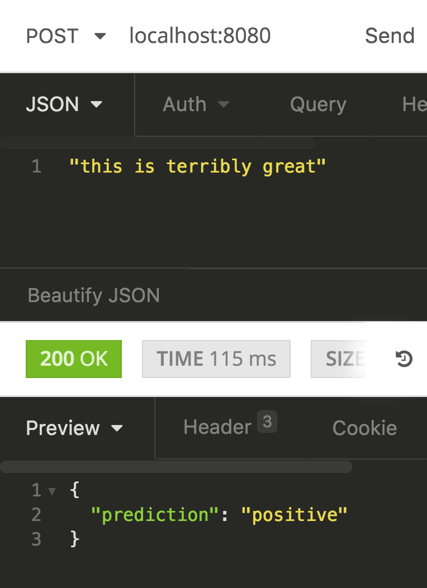

# Sentiment Classification Service

## Getting started

1. Clone the repo and `cd` into the directory: `git clone https://github.com/your-username/email-classification && cd email-classification`

3. Run `bin/setup.sh`. This script will:

	- Install python3

	- Create a virtual environment folder in your project directory and install some dependencies which are commonly used in machine learning, such as:
		- jupyter
		- pandas
		- numpy
		- sklearn
		- nose (for unit tests)

4. To activate the virtual environment `source .venv/bin/activate`

5. Download data
  - The yelp dataset is 2gb, and the yelp webpage requires your name and email before you can download it. You can download the **JSON** dataset from [here](https://www.yelp.com/dataset/download), and place it in the `./data/yelp`. Alternatively, you can also download it from the machine learning group [team drive](https://drive.google.com/drive/folders/1EBuyVQ0H_crM__0X8bchSax_zCVf8TgT)
  - after unzipping the dataset, move review.json to `./data/yelp/dataset/`
  - Run this command `head -400000 ./data/yelp/dataset/review.json > ./data/yelp/dataset/review_400000_samples.json`

6. To run unit tests, statistical tests, or all tests, run one of the following
    - `bin/run_unit_tests.sh`
    - `bin/run_statistical_tests.sh`
    - `bin/run_all_tests.sh`

7. To train the model, run `python app/train_yelp.py`

8. To start the webserver, run `python app/webserver.py`. Now you make `POST` requests to `localhost:8080/` with a string as a payload:

7. To work with jupyter notebook, run `jupyter notebook`

## IntelliJ tests config

To configure the tests to run on IntelliJ, Select 'Edit Configurations...' and configure it as such:

